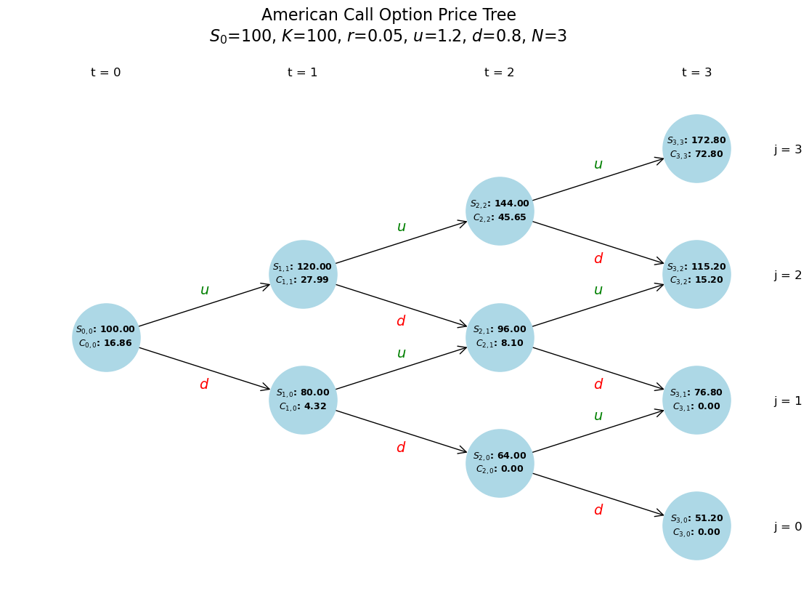

# Binomial Option Pricing Model Visualizer

This project implements and visualizes an American-style binomial option pricing model in Python. It uses the `networkx` library to build the underlying tree structure and `matplotlib` to create a clear, publication-quality visualization of all nodes.

The script calculates both the underlying asset price and the corresponding option price (Call or Put) at every node in the tree using backward induction.




---

## 🏛️ Core Features

* **Tree Generation:** Dynamically generates an N-step binomial tree structure.
* **Price Calculation:** Calculates the underlying asset price ($S_{t,j}$) for every node based on the initial price ($S_0$), up-factor ($u$), and down-factor ($d$).
* **Backward Induction:** Prices an **American-style** option (Call or Put) by:
    1.  Calculating the option's intrinsic value at maturity (at $t=N$).
    2.  Working backward, calculating the value at each node ($t < N$) as the maximum of its "early exercise" value and its "discounted expected future value."
* **Rich Visualization:** Uses `networkx` and `matplotlib` to plot the complete tree, including node labels, stock prices, option values, and `u`/`d` labels on the branches.
* **Flexible Display:** Features a `display_mode` variable to easily switch between three levels of detail on the graph, from a simple structural view to a full pricing breakdown.

---

## 💡 How It Works

The model follows two main phases:

### 1. Forward Price Propagation (Tree Build)

The script first builds the tree from $t=0$ to $t=N$. It calculates the stock price at each node `(t, j)` (where `t` is the time step and `j` is the number of "up" moves) using the formula:

$$S_{t,j} = S_0 \times u^j \times d^{(t-j)}$$

### 2. Backward Option Valuation (Pricing)

Once the final stock prices at $t=N$ are known, the option is priced using backward induction.

1.  **At Maturity ($t=N$):** The option value is its intrinsic value.
    * **Call:** $C_{N,j} = \max(0, S_{N,j} - K)$
    * **Put:** $P_{N,j} = \max(0, K - S_{N,j})$

2.  **At Any Prior Node ($t < N$):** The value of an American option is the greater of:
    * **Value if Exercised (Intrinsic Value):** $\max(0, S_{t,j} - K)$
    * **Value if Held (Discounted Expected Value):**
        $$[p \cdot C_{t+1, j+1} + (1-p) \cdot C_{t+1, j}] \times e^{-r \Delta t}$$
    
    ...where $p$ is the risk-neutral probability: $p = \frac{e^{r\Delta t} - d}{u - d}$

The script calculates this for every node, ultimately finding the option's value at the root node, $C_{0,0}$.

---

## 🚀 How to Use

1.  **Clone or download** this repository.
2.  **Install** the required libraries:
    ```bash
    pip install networkx matplotlib
    ```
3.  **Run** the script:
    ```bash
    python binomial_option_pricer.py
    ```
    This will run the script and save the final graph as `binomial_tree_with_option_price.png` in the same folder.

---

## ⚙️ Customization (Parameters)

You can easily change the model's behavior by adjusting the parameters at the top of the `binomial_option_pricer.py` script.

### Key Model Parameters
* `N`: Number of time steps.
* `S0`: Initial stock price.
* `K`: Strike price of the option.
* `r`: Risk-free interest rate.
* `T`: Time to maturity (in years).
* `u`, `d`: Up and down factors (or `sigma` if you implemented the CRR version).
* `option_type`: Change to `'call'` or `'put'`.

### 🎨 Display Mode
The most powerful parameter for visualization is **`display_mode`**:

* **`display_mode = 1`:** (Simple) Shows only the node labels (e.g., $S_{2,1}$). Ideal for teaching the tree *structure*.
* **`display_mode = 2`:** (Stock Price) Shows the node label and its corresponding stock price (e.g., $S_{2,1}$ \n $\$96.00$).
* **`display_mode = 3`:** (Full Price) Shows the node label, stock price, and the calculated option value (e.g., $S_{2,1}: \$96.00$ \n $C_{2,1}: \$5.45$).
